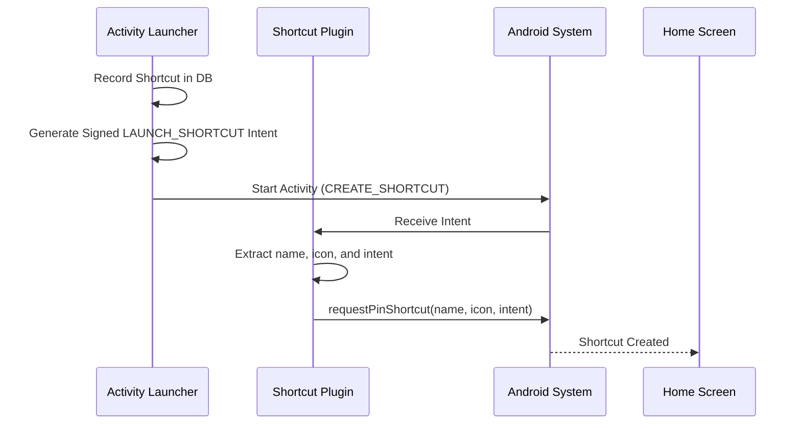
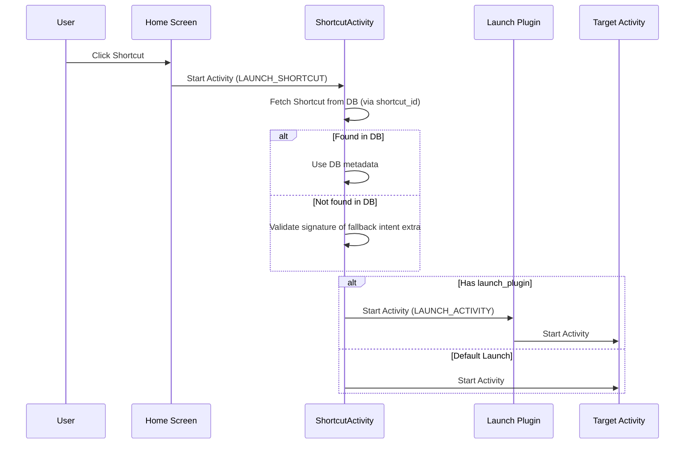

# Plugin Architecture

Activity Launcher supports external plugins for shortcut creation and activity launching. This document describes the intent-based protocol used to communicate with these plugins.

## Shortcut Creation Flow

When a user requests to create a shortcut, Activity Launcher sends a `CREATE_SHORTCUT` intent. A plugin can register for this action to handle the shortcut creation (e.g., to provide custom icons, labels, or to use a different shortcut pinning mechanism).

### Intent: `activitylauncher.intent.action.CREATE_SHORTCUT`

| Extra               | Type   | Description                                                           |
|---------------------|--------|-----------------------------------------------------------------------|
| `name`              | String | The suggested name for the shortcut.                                  |
| `icon`              | Bundle | The icon as a `IconCompat` bundle.                                    |
| `intent`            | String | The pre-configured `LAUNCH_SHORTCUT` intent URI.                      |

**Note:** Plugins should use the provided `intent` URI as the shortcut's target intent. This intent already contains the `shortcut_id` and signed fallback metadata.

### Sequence Diagram

## Shortcut Launch Flow

When a shortcut created by a plugin is clicked, it launches Activity Launcher's `ShortcutActivity` with the `LAUNCH_SHORTCUT` action (as configured in the `intent` extra).

### Intent: `activitylauncher.intent.action.LAUNCH_SHORTCUT`

| Extra           | Type   | Description                                                           |
|-----------------|--------|-----------------------------------------------------------------------|
| `shortcut_id`   | String | The UUID of the shortcut in Activity Launcher's database.             |
| `intent`        | String | The target intent URI (fallback).                                     |
| `sign`          | String | The signature of the target intent (fallback).                        |
| `launch_plugin` | String | Flattened `ComponentName` of a launch plugin (fallback).              |

### Sequence Diagram

## Launch Delegation

If the shortcut requires launch delegation (specified in the database), `ShortcutActivity` will delegate the launch to the specified component.

### Intent: `activitylauncher.intent.action.LAUNCH_ACTIVITY`

Sent to the component specified as the launch plugin.

| Extra    | Type   | Description                                      |
|----------|--------|--------------------------------------------------|
| `intent` | String | The validated target intent encoded as a URI.    |

If no launch plugin is provided, Activity Launcher performs the default launch using `context.startActivity()`.

## Legacy Support

Activity Launcher maintains backward compatibility for existing shortcuts on users' home screens that were created using legacy protocols.

### Legacy LAUNCH_SHORTCUT Extras

Supported for backward compatibility during launch, but **no longer used during creation**:

| Extra           | Type   | Description                                                           |
|-----------------|--------|-----------------------------------------------------------------------|
| `intent`        | String | The target intent URI.                                                |
| `sign`          | String | The signature of the target intent.                                   |
| `launch_plugin` | String | Flattened `ComponentName` of a plugin to handle the launch.           |
| `extra_intent`  | String | Alternative key for `intent` (v2.2.0 and below).                      |

## Intent Encoding

To ensure robustness and support for complex intents (including extras), Activity Launcher uses `Intent.toUri(Intent.URI_INTENT_SCHEME)` for encoding intents. Legacy URIs (flag `0`) are still supported for backward compatibility.
